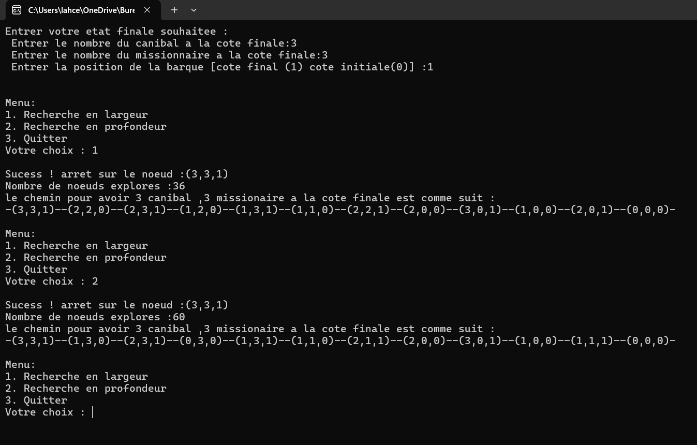

# Missionnaire-Cannibale

Ce dépôt contient une implémentation du problème des missionnaires et des cannibales avec deux approches différentes, ainsi qu'une description détaillée de leur comparaison en termes de performances.

## Contenu du dépôt

1. **Exécutable**  
   - Vous trouverez le fichier `.exe` de l'application dans le dossier :  
     `bin/debug`.

2. **Rapport détaillé**  
   - Un rapport au format PDF est inclus dans ce dépôt. Il fournit une analyse complète du problème, les deux approches utilisées, et une comparaison des performances :
     - **Approche avec structure utilisant des entiers**.
     - **Approche avec représentation en bits**.

## Comparaison des performances

- **Approche avec des entiers :** Cette méthode utilise une structure basée sur des entiers pour représenter les états du problème.  
- **Approche avec des bits :** Cette méthode utilise une représentation binaire pour optimiser la gestion des états.  
- Le rapport PDF détaille la différence en termes de **temps d'exécution** et **mémoire utilisée**.

---

### **Exemple de résultat**

---

### **Comment exécuter l'application ?**

1. Accédez au dossier `bin/debug`.
2. Lancez le fichier `.exe`.
